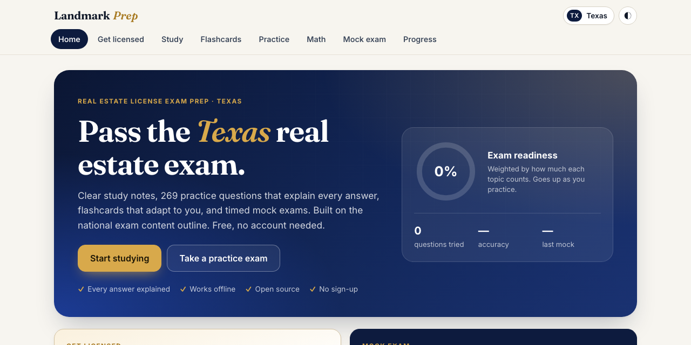
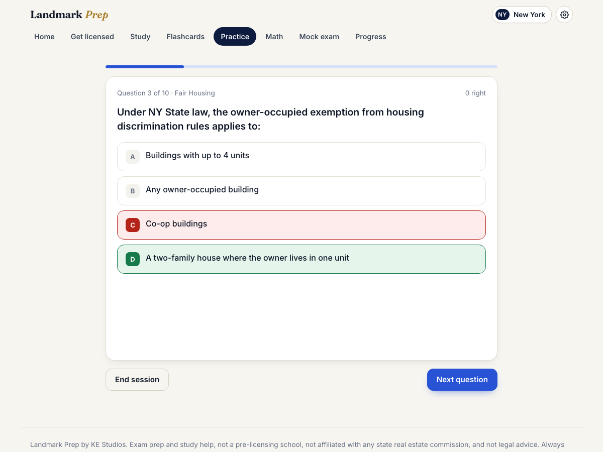
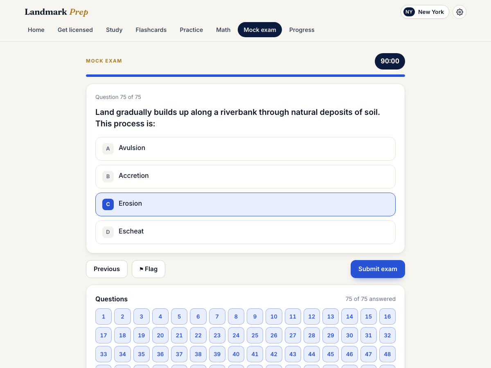
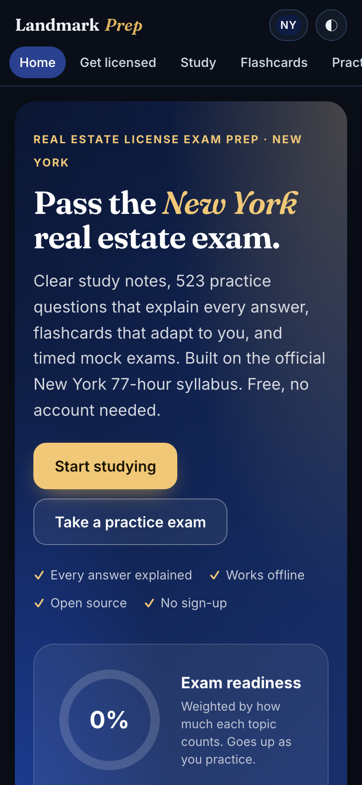
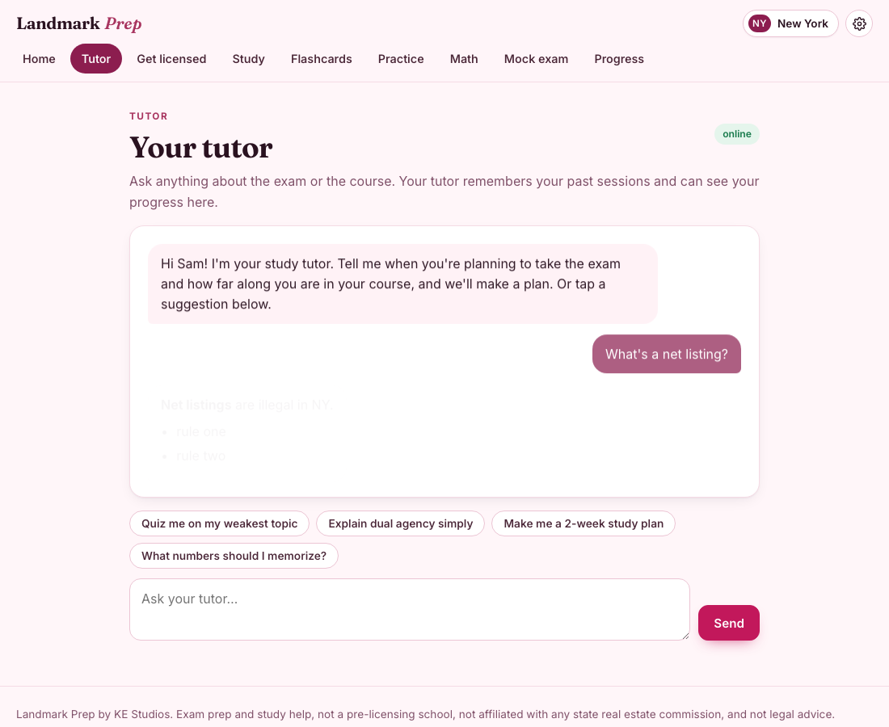

# Landmark Prep

Free, open-source exam prep for the **real estate salesperson license, in every state**. Pick your state and it tailors the notes, practice, mock exam and licensing roadmap. It has no accounts and nothing to install, and it works offline.

**Use it now:** https://willykeenan.github.io/landmark-prep/



## Two tracks

- **New York: the full course.** It covers all 19 subjects of the official 77-hour syllabus, including NY law, with a New York–format mock exam (75 questions, 90 minutes, 70% to pass).
- **Every other state: the national exam core.** It covers the 11 topics of the national (multistate) portion that every state's exam shares. Your state's official requirements appear alongside. State-law courses for more states are coming.

## What's inside

| | |
|---|---|
| **Study notes** | 19 New York units and 11 national units, each with a "numbers to know" table and an "exam traps" list. |
| **792 practice questions** | 523 for New York and 269 for the national core, all original, with an explanation for every answer. Practice by unit, unseen, or missed-last-time. |
| **Flashcards** | 423 key terms with spaced repetition (Leitner boxes). The national track drops the 34 New York–only terms. |
| **Mock exam** | Drawn from every unit in proportion to its study hours. You get pass/fail, a per-unit breakdown and a full review. New York uses the state format; other states get the national portion, sized to their exam. |
| **Unlimited math drills** | 24 problem types, including commission splits, net-to-seller, prorations, cap rates and depreciation. New York adds transfer, mortgage-recording and mansion tax. Problems are freshly generated each time. |
| **Licensing roadmap** | Step by step, with official links. New York shows how to get licensed for about **$80 total** (a free state-approved 77-hour course, the $15 exam and the $65 license). Every other state shows its quoted requirements. |
| **Your next step** | The home page walks you through getting licensed one step at a time, with the link you need for each (for New York: the free state-approved course, your NY photo ID at the DMV, booking a proctor, the exam, a sponsoring broker). Enter your course hours and a target date to get a weekly pace. |
| **Works with your AI** | Every question, topic, flashcard and licensing step has a button that opens your own ChatGPT or Claude with a ready-made prompt (explain this, teach me this, quiz me on my weak spots, help me with this step). Nothing goes through us. |
| **Make it yours** | Settings has color themes (Classic navy and gold, Blush pink and white, Lavender) in light or dark, each checked for WCAG AA contrast. |

Progress is saved in your browser, and you can export or import it to switch devices.

| Practice | Mock exam | Mobile |
|---|---|---|
|  |  |  |

## State facts are quoted, not guessed

Each state's pre-licensing hours, exam vendor, question counts and passing score were collected in September 2026 from official pages only: the state regulator, other .gov sites, and the exam vendors' candidate bulletins. Every number carries the exact sentence it came from and a link, and the app shows them under **Where each number comes from**.

48 of 51 states (with DC) have quoted hours, backed by 193 quoted facts in all. Anything that couldn't be confirmed is left blank and labelled, never filled in from memory.

Check that every quote is still on its official page:

```bash
node scripts/check-state-sources.mjs          # all states (needs network; PDFs need pdftotext)
node scripts/check-state-sources.mjs TX NJ    # just these
```

## Use it inside ChatGPT or Claude

There are two ways, and neither needs an account with us:

1. **Ask buttons (any plan, including free).** Every question, topic, flashcard and licensing step has a button that opens the student's own ChatGPT or Claude with a ready-made prompt. Pick which one in Settings.
2. **Connector (MCP).** Add `https://landmark-prep.vercel.app/mcp` as a connector, and ChatGPT or Claude can call Landmark Prep's tools right in the chat:
   - `licensing_steps`: the path to a license in any state;
   - `state_requirements`: facts quoted from official sources;
   - `list_topics` and `study_notes`: the study notes;
   - `practice_questions` and `check_answer`: practice with explanations.

   Setup:
   - **Claude (any plan):** Settings, Connectors, Add custom connector.
   - **ChatGPT (paid plans):** turn on Developer mode, then create an app with the address and no authentication.

   The server is read-only, keeps no state and needs no login. It lives in `api/mcp.js` (a Vercel function) and `mcp/core.js`, and `node tests/mcp.test.mjs` checks the protocol and every tool.

## Optional: a personal AI tutor that runs on your own computer

`tutor/tutor_server.py` is a small local service (Python standard library only) that powers a **Tutor** tab in the app. It answers with the [Claude Code](https://claude.com/claude-code) CLI using that CLI's own login, grounded in the New York study notes (`tutor/knowledge.md`, built by `node tutor/build_knowledge.mjs`).

- **Per-student memory, database style:** a local SQLite database holds each user's access level (`granted` / `paid` / `none`), full conversation history, latest study progress, and a short **brainfile**. The tutor rewrites the brainfile as it learns the student's goals, weak spots and preferences, and mirrors it to `data/brains/<user>.md`.
- **Locked down:** the model runs with **no tools** (`--tools ""`), no MCP servers, no user or project settings or hooks, in an empty temporary directory. It can only return text. Requests need a shared bearer token, and there are per-user rate limits.
- **Progress sync:** with the tutor configured, the app also saves the student's whole study state to their account (`GET`/`POST /state`, newest save wins), so it follows them between phone and laptop.
- **Hook it up:** serve the app with `<html data-tutor-api="/your/api">`. Your server handles sign-in and forwards `POST /chat` and `GET /history` to the tutor with `Authorization: Bearer <token>` and `X-KE-User: <username>`. Forward `/state` the same way. Optional: `data-default-state="NY"` opens on a state, `data-default-palette="blush"` picks the starting colors, and `data-user-name="Sam"` greets the student by name.
- **Runs under launchd/systemd:** the service finds the `claude` CLI in the usual install locations and passes the account name the CLI needs to find its login.



```bash
python3 tutor/tutor_server.py --env-file tutor.env user-add sam --name Sam --access granted
python3 tutor/tutor_server.py --env-file tutor.env serve     # tutor.env: TUTOR_TOKEN=<32+ chars>, chmod 600
```

## Important

- This **does not replace your state's required pre-licensing course**. Every state requires education from a school it approves before you can be licensed. For New York, the roadmap shows a free option.
- It is **not legal advice** and not affiliated with any state real estate commission. Laws, fees and exam formats change, so confirm with your state's regulator.
- The questions are **original**. They are not copied from any exam, course or book, and they are not actual state exam questions.
- Nothing here takes payments, and there are no accounts. AI help runs in the student's own ChatGPT or Claude: the "Ask" buttons open a new chat there with the question, topic or step already written in. The terms, privacy and refund pages (`legal/`) describe how a paid plan would work if one is ever offered.

The New York content was checked in September 2026 against:

- the DOS 77-hour curriculum;
- the DOS *Real Estate License Law* booklet (March 2026 edition);
- the DOS salesperson pages;
- later changes, including the 2024 Property Condition Disclosure amendments, the DOS-2156 Housing & Anti-Discrimination Disclosure form, HSTPA tenant rules and the NYC FARE Act.

## Run it locally

It's a static site with no build step:

```bash
python3 -m http.server 8000
```

Then open http://localhost:8000.

## Tests

```bash
node tests/validate.mjs        # content and logic checks (no dependencies)
python3 tests/e2e.py           # headless browser run-through, New York and national tracks (pip install playwright && playwright install chromium)
python3 tutor/test_tutor.py    # tutor service: access levels, isolation, brainfile, rate limits, tool-free model call
python3 tests/e2e_tutor.py     # Tutor tab in the browser against a fake-model tutor
```

`validate.mjs` checks:

- the syllabus hours;
- well-formed, unique questions on both tracks;
- balanced answer positions;
- 12,000 generated math problems;
- the mock-exam allocation;
- that no state number is shown without an official quote that supports it;
- that no data file contains code;
- a list of known-stale facts that must not appear.

## Contributing

Corrections are especially welcome. See [CONTRIBUTING.md](CONTRIBUTING.md).

## License

- Code: [MIT](LICENSE)
- Study content (notes, questions, flashcards): [CC BY 4.0](LICENSE-CONTENT)
- Fonts: Inter and Fraunces, [SIL Open Font License 1.1](fonts/)
